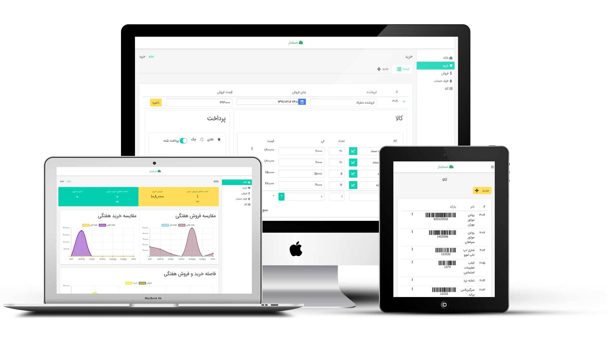

# حسابدار
ابزار ساده مدیرت مالی کسب‌و‌کار‌های کوچک و متوسط

## حسابدار چیست؟
حسابدار ابزاری ساده برای مدیریت یک فروشگاه کوچک و متوسط است، به طوری که کاربر بتواند با یک آموزش چند دقیقه‌ای به فعالیت کسب‌و‌کار خود نظم دهد.

## فروشندگان چه مشکلاتی دارند؟

- فروشنده امکان محاسبه ی سود و زیان روزانه ی خود را ندارد یا حوصله و وقت انجام این محاسبه را ندارد
- فروشنده به طور دقیق نمی داند که همکار ( شاگرد ) خود به چه مقدار فروش داشته اند
- فروشنده آمار خرید و فروش روز ها، هفته ها و ماه های قبل را فراموش می کند
- فروشنده نمی تواند بطور دقیق میزان پیشرفت و پسرفت سود مالی کسب و کار خود را محاسبه کند
- فروشنده برای محاسبه ی میزان بدهی و طلبکاری خود با طرف حساب های خود، باید زمان زیادی برای جمع و تفریق بگذارد
- فروشنده می خواهد منظم باشد، اما به دلیل رفت و آمد و فشار کار، امکان ایجاد نظم را ندارد
- فروشنده حوصله ی کار با کامپیوتر را ندارد 
- فروشگاه به اندازه ای بزرگ نیست که امکان استخدام یک حسابدار وجود داشته باشد

## چرا حسابدار ساخته شده؟

حسابدار ساخته شده تا یک فروشنده، بدون نیاز به مفاهیم و اصطلاحات تخصصی حسابداری فعالیت های مالی خود را به صورت منظم در آورد

## نصب و کار با حسابدار
درحال توسعه
## حسابدار برای توسعه‌دهنده
درحال توسعه